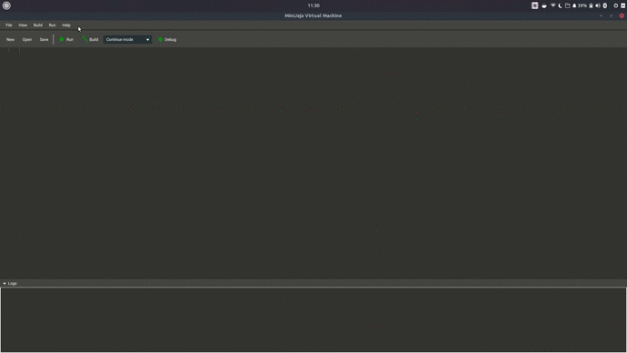

## What is it ?

This project was made for the **Compilation** class of my Master's Degree in 2018.

The aim was to build a IDE with a compiler, interpreters and debuggers for the languages MiniJava (minmal version of Java) and JajaCode (JajaCode is the result of MiniJaja compilation).

This IDE allows users to create, open and edit MiniJaja files. 
Users can also run, compile, debug their program inside the IDE.

When debugging users have acces to memory data : 
- the current state of the stack
- the current state of the heap

2 Debugging modes are available : 
- continous debbugging : the excecution stops whenever It passes throught breakpoints previouly set by users.
- step by step debugging: the execution stops at each line of the program.

## How is it made ?

This application is build with JAVA and is **fuflly tested** with a test-coverage of 98%.

This project was carried out by an agile team of 7 person, with the SCRUM methodologie.

## Demo

In this demonstation we can see an intersting sequence of actions :
- a MiniJaja program is being loaded and executed
- break points are added, and the program is executed in continous debugging mode
- the MiniJaja program is compiled in a JajaCode program
- the JajaCode program is executed
- the JajaCode program is executed in a step by step debugging mode

